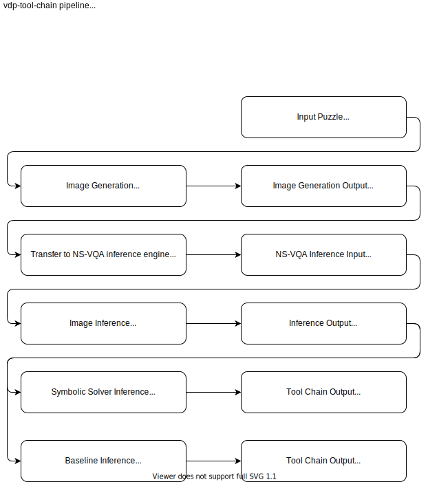

# VDP Tool Chain

TODOS:
* ~~Annotate `tree` output~~
* ~~Add figures.~~
* ~~Add ## subsections.~~
* Add link to data (Email authors or open an issue if not available).

This repository contains all the code for running the `vdp` project. The (general) organization and key scripts are detailed below:

```bash
.
├── driver.sh                                         # See ## Driver for details.
├── README.md                                         # This file.
├── clevr_generate                                    # Code for generating custom CLEVR-domain images.
│   ├── image_generation                              # (Code to regenerate clevr-instances)
│   ├── notebooks                                     # (Notebooks to aggregate clevr-data)
│   └── question_generation                           # (Not used: code to generate questions for cler-puzzles)
├── clevr_inference                                   # Code to infer object positions for CLEVR-domain images.
│   ├── reason                                        # (NS-VQA reasoning code.)
│   ├── driver.sh                                     # Script to run clevr_inference.
│   ├── ns-vqa-readme.md                              # Original setup instructions and citation
│   ├── running-ns-vqa-inference.md                   # Instructions to setup and run the code in this folder.
│   ├── collate.py                                    # Script that 'collects' the ns-vqa output for the vdp_solver solver
│   └── scene_parse                                   # (NS-VQA code for parsing clevr-scene)
├── data                                              # See ## Data for more details.
│   ├── clevr-ann                                     # Website data: CLEVR-annotations.
│   ├── clevr-better-puzzles-test                     # Experiments for making new puzzles
│   ├── clevr-irs                                     # IRs used to generate website data.
│   ├── clevr-puzzles                                 # Base CLEVR puzzles.
│   ├── clevr-variants                                # Variants of the base CLEVR puzzles
│   ├── images                                        # Website data: CLEVR-images
│   ├── inference-outputs                             # Output folder for inference.
│   ├── inference-gt-outputs                          # (Hand-made "inferred" puzzles.)
│   ├── ns-vqa-data                                   # ns-vqa pretrained models and raw data
│   ├── output                                        # Contains `clevr_generate` output scenes and images 
│   ├── submission_files                              # Files submitted as supplementary material for ICML21
│   └── vizs                                          # Matplotlib generated viz of each puzzle. 
├── notes                                             # Section containing some notes about experimentation.
├── triplet_loss_baseline                                       # Pretrained Baseline model (DeepRanking)
│   └── driver.sh                                     # Script to run pretrained baseline
│   ├── README.md                                     # Original README w/ citation and installation instructions 
│   ├── test_clevr.py                                 # Script to run a CLEVR-domain puzzle through model.
│   └── test_yolo.py                                  # Script to run a natural-scene puzzle through the model.
├── utils                                             # Scripts to help make and debug puzzles.
└── vdp_solver                                        # See ## VDP for details.
└── vdp                                               # See ## VDP for details.
```

## Installation

1. Setup a Amazon AWS `p2.xlarge` instance. We used the `Deep Learning AMI (Ubuntu 16.04) Version 38.0 (ami-067cf9e6ac97cfb53) ` Amazon Machine Image with 105 GiB gp2 storage volume. Running all the experiments from scratch takes about 24-30 hours of compute time (less than $50). I was able to get everything other than the `clevr_inference` repository running on a non-16.04 linux machine. So if you don't care about the CLEVR domain feel free to use your own machine.
2. Clone this git repository. The homepath should look like `/home/ubuntu/vdp-tool-chain` (this *exact string* has been hardcoded in a lot of places. If you prefer running this on a local machine then you'll need to group-replace-all this path with the project path).
3. Install the conda environments. There should be 4 `*-spec.txt` files in the `data/conda-envs` folder. Create a conda environment from these. That is:
```bash
$ conda create --name ns-vqa --file data/conda-envs/ns-vqa-spec.txt
$ conda create --name deep-ranking --file data/conda-envs/deep-ranking-spec.txt
$ conda create --name torch --file data/conda-envs/torch-spec.txt
$ conda create --name vdp --file data/conda-envs/vdp-spec.txt
```
4. Download the `data.zip` data bundle and extract the directory to `~/vdp-tool-chain/data`.
5. The data.zip file contains basically all the extra files needed to run the VDP model in one convenient spot.

No action is needed for generating the `vdp` and `gqa` datasets. The data bundle should have these datasets nicely formatted for the inference stage.

For the CLEVR dataset we need to setup blender and add a link to the CLEVR shapefile data.

* Download and extract Blender 2.78c from [here](https://download.blender.org/release/Blender2.78/blender-2.78c-linux-glibc219-x86_64.tar.bz2).
* Extract Blender to `{project_dir}/data/blender-2.78c-linux-glibc219-x86_64.tar.bz2`
* Alias the Blender Binary.
* Add the directory containing CLEVR shapefiles data. echo $PWD/image_generation >> /home/ubuntu/clevr/blender-2.78c-linux-glibc219-x86_64/2.78/python/lib/python3.5/site-packages/clevr.pth`
* Run blender using `blender --background --python render_images.py -- --num_images 10 --use_gpu 1`
* THe file that needs to be edited is @ `/home/ubuntu/clevr/clevr-dataset-gen/image_generation/render_images.py`

```
# Setup CLEVR Dataset. Replace {} with appropriate string.
$ cd data
$ wget https://download.blender.org/release/Blender2.78/blender-2.78c-linux-glibc219-x86_64.tar.bz2
$ tar xf blender-2.78c-linux-glibc219-x86_64.tar.bz2
$ alias blender='$PWD/blender-2.78c-linux-glibc219-x86_64/blender
$ echo "$PWD/__generate/clevr/" > blender-2.78c-linux-glibc219-x86_64/2.78/python/lib/python3.5/site-packages/clevr.pth
```


## Running the entire pipeline


1. Start a `p2.xlarge` AWS instance (what was used for all these experiments).
1. Download `data.zip` from the link given and extract in the project directory.
1. Initialize the conda environments in from `data/conda_envs` with `conda env create -f {conda_env.yaml}`
1. `(base) $ python utils/generate-variants.py` will run the pipeline on the variants @ `data/clevr-cleaned-variants` (~5-8 hours).
1. `(torch) $ python utils/train_puzzles.py` will train the prototype network with the correct hyperparameters.
1. Other code used to aggregate the data can be found under `analysis/`. Also, `utils/` has a lot of misc. utilities that I found helpful!


## Driver
The `driver.sh` file is the central file to run an experiment through the vdp-tool-chain. The help menu provides more details:
```bash
$ ./driver.sh -h
This script must be run with the following arguments.
Usage:
./driver.sh {PUZZLE_PATH} {PUZZLE_NAME} {TRAIN_SET} {TEST_SET} {VDPFLAGS}
Example Usage:
./driver.sh data/clevr-puzzles/alternate-color.json test "3 4 5 6" "0 1 2" "- 2 -N 100 -C 2"
``` 
Internally, the `driver.sh` file runs the corresponding "driver" script for each directory. A broad overview is presented below:


## Data

The `data/` folder contains all data used by the tool-chain. This includes pretrained models, csv files, json configuration files, etc. The data directory can be downloaded from here (5.6 GB): `TODO:PROVIDE DRIVE LINK`


## VDP

The `vdp_solver` folder is a bare-bones version of the symbolic solver that is available here: `https://github.com/anonymousocean/vdpicml2021/tree/master/satbasedsolver`

The `vdp` folder contains the code to generate the IR from the VDP images using the YOLO model.  